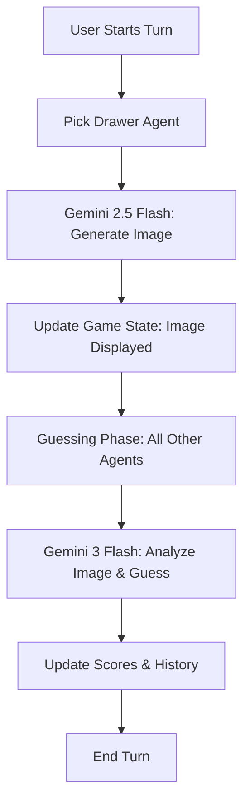

# Artie 🎨

Artie is a multi-agent, AI-powered drawing and guessing game. It features a cast of diverse AI agents, each with their own unique artistic personality, drawing style, and "brain" for guessing. Powered by Google's Gemini 2.5 and 3.1 models, it demonstrates the creative and analytical capabilities of modern LLMs in a fun, interactive environment.

## Features

- **Multi-Agent Simulation**: 5 distinct AI agents (Artie, Pixel, Sketch, Doodle, Master) with unique personalities.
- **Personality-Driven Drawing**: Agents generate images based on their specific artistic style (e.g., abstract, pixel art, minimalist).
- **Intelligent Guessing**: Agents "see" the generated images and attempt to guess the word using multimodal AI.
- **Game Modes**:
  - **Standard**: Agents take turns drawing and guessing.
  - **Timed**: A high-pressure mode with a 15-second guessing window.
  - **Team**: Agents are split into teams, and only teammates can guess.
- **Custom Words**: Users can input their own words to challenge the AI's creativity.
- **Live Feed**: Real-time logging of agent thoughts and game events.
- **Game History**: A visual gallery of all drawings from the current session.
- **Deep Agent Profiles**: Detailed backstories, unique traits (e.g., "Emotional", "Logical"), signature moves, and quirky fun facts for every AI participant.
- **Dedicated Agents Section**: A new interactive tab to explore the full roster and dive deep into each AI's artistic philosophy.
- **Interactive Modals**: Click on any agent to see their full profile, stats, and signature drawing style.

## Technologies Used

- **Frontend**: React 18, TypeScript, Tailwind CSS.
- **Animations**: Framer Motion (motion/react).
- **Icons**: Lucide React.
- **AI Models**:
  - **Gemini 2.5 Flash Image**: Used for personality-driven image generation.
  - **Gemini 3 Flash**: Used for multimodal image analysis and guessing.
- **SDK**: `@google/genai` for seamless model interaction.

## Architecture

The application follows a state-driven architecture where the "Game Engine" (managed via React state) orchestrates the flow between drawing and guessing phases.



### Key Code Snippet: Personality-Driven Drawing

```typescript
const response = await ai.models.generateContent({
  model: 'gemini-2.5-flash-image',
  contents: {
    parts: [{ 
      text: `A drawing of a ${word}. Style: ${drawer.drawingStyle}. 
             Artie style, white background, bold lines. 
             Make it look like it was drawn by a human with this personality.` 
    }]
  },
  config: {
    imageConfig: { aspectRatio: "1:1" }
  }
});
```

## Getting Started

### Prerequisites

- Node.js (v18 or higher)
- A Google AI Studio API Key

### Installation

1. **Clone the repository**:
   ```bash
   git clone https://github.com/harishkotra/artie.git
   cd artie
   ```

2. **Install dependencies**:
   ```bash
   npm install
   ```

3. **Set up environment variables**:
   Create a `.env` file in the root directory and add your API key:
   ```env
   GEMINI_API_KEY=your_api_key_here
   ```

4. **Run the development server**:
   ```bash
   npm run dev
   ```

## Contributing

Contributions are welcome! If you'd like to improve the game, here are some ideas:

- **New Agents**: Add more personalities like "The Architect" or "The Surrealist".
- **Multiplayer Mode**: Allow human players to join the lobby and guess alongside the AI.
- **Voice Integration**: Use Gemini's TTS to have agents announce their guesses.
- **Advanced Scoring**: Award points based on how quickly an agent guesses.

### How to Contribute

1. Fork the project.
2. Create your feature branch (`git checkout -b feature/AmazingFeature`).
3. Commit your changes (`git commit -m 'Add some AmazingFeature'`).
4. Push to the branch (`git push origin feature/AmazingFeature`).
5. Open a Pull Request.